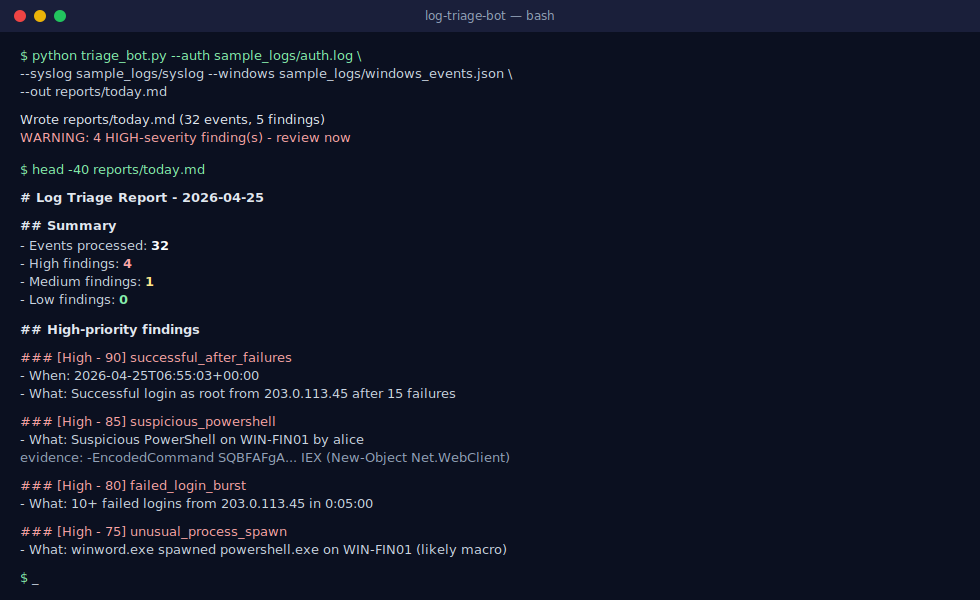

# App Log Analyzer



[](https://github.com/diallosanazy/app-log-analyzer/actions/workflows/ci.yml)

A small **Python + PowerShell** automation that scans application logs across
multiple sources for problems worth looking at and emits a daily Markdown
summary.

I built this because mornings during my software-engineering internship at
The Difference App started the same way: open three log tabs, scroll, try to
remember what was loud yesterday. This script does that for me — one command,
one report, ranked by how much it actually matters.

## What it detects

| Rule                     | What it looks for                                                |
|--------------------------|------------------------------------------------------------------|
| `error_burst`            | >= 5 errors from the same endpoint within 5 minutes              |
| `exception_spike`        | The same exception class appearing >= 5 times in the window      |
| `slow_endpoint`          | An endpoint averaging > 2000 ms response time across many hits   |
| `regression_after_deploy`| Errors clustered within 15 min of a deployment marker            |
| `new_exception_type`     | An exception class that hasn't appeared in the prior baseline    |

Each match becomes a finding with a numeric score (10-100). Findings >= 70 are
flagged **High**; >= 40 **Medium**; the rest **Low**.

## Stack

- Python 3.10+ (stdlib only — no third-party deps for the parser/scorer)
- PowerShell 5.1+ for `collect_iis_logs.ps1` (writes a normalized JSON file)
- Sample logs in `sample_logs/` so the project runs out of the box

## Quickstart

```bash
git clone https://github.com/diallosanazy/app-log-analyzer.git
cd app-log-analyzer

# Run on the bundled sample logs
python3 analyzer.py \
    --app sample_logs/app.log \
    --access sample_logs/access.log \
    --structured sample_logs/events.json \
    --out reports/today.md

cat reports/today.md
```

To pull IIS access logs from a Windows app server:

```powershell
.\collect_iis_logs.ps1 -Hours 24 -OutFile iis_events.json
```

Then point the Python analyzer at the resulting JSON.

## Daily summary report

The analyzer writes a Markdown report to `reports/<date>.md` with three
sections:

1. **High-priority findings** (score >= 70) — what to look at now.
2. **Medium / Low findings** — for the daily review.
3. **Stats** — events processed, top endpoints, top exception types, time range.

Drop the script into cron / Task Scheduler and email the file daily.

## File layout

```
app-log-analyzer/
├── analyzer.py             # CLI entrypoint
├── parsers.py              # App / access / structured-JSON parsers
├── rules.py                # Detection rules + scoring
├── collect_iis_logs.ps1    # Pull recent IIS events into normalized JSON
├── sample_logs/            # Realistic sample inputs
└── reports/                # Generated reports
```

## License

MIT
